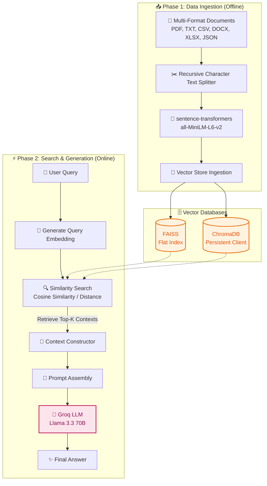
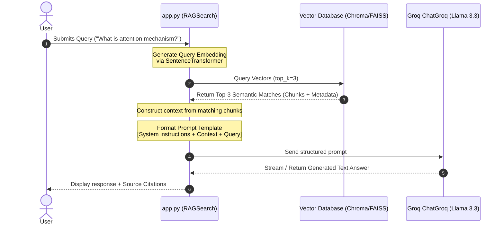

# 🔍 RAG Basics: Deep Dive & Architecture

[](https://www.python.org/)
[](https://github.com/langchain-ai/langchain)
[](https://github.com/chroma-core/chroma)
[-red.svg?style=flat-square)](https://groq.com/)

An educational, step-by-step implementation of a **Retrieval-Augmented Generation (RAG)** pipeline. This project breaks down how custom document collections are ingested, embedded, stored, and queried to generate context-aware answers using LLMs.

---

## 🏗️ System Architecture

The following diagram illustrates how data flows through the RAG pipeline during both **Ingestion** (offline) and **Retrieval/Generation** (online) phases:



---

## ⏱️ Interactive Sequence Flow

When a user asks a question, here is the exact chronological execution flow of the system:



---

## 🗄️ Vector Database Comparison

This repository is configured to demonstrate two popular vector database options:

| Feature | 🗃️ ChromaDB | ⚡ FAISS |
| :--- | :--- | :--- |
| **Type** | Full Vector Database (Server / Serverless) | Vector Indexing Library |
| **Storage** | SQLite-backed persistent directory | In-memory with file serialization (`.index`/`.faiss`) |
| **Metadata Filtering**| Built-in native filtering (SQL-like dicts) | Requires external indexing or wrapper |
| **Best Used For** | Prototyping, full RAG apps with metadata queries | High-performance similarity search on raw vectors |

---

## 📁 Repository Structure

```text
├── README.md                  # Comprehensive documentation and diagrams (this file)
├── requirements.txt           # Python dependencies
└── Understanding/             # Main project directory
    ├── app.py                 # Core application entry point
    ├── data/                  # Directory containing docs to ingest (PDFs, TXTs, etc.)
    ├── notebook/              # Step-by-step Jupyter Notebook walkthroughs
    │   ├── data ingestion.ipynb
    │   └── pdf_loader.ipynb
    └── src/                   # Core modular packages
        ├── data_loader.py     # Document loaders for all supported extensions
        ├── embedding.py       # SentenceTransformers pipeline
        ├── search.py          # RAG retrieval and execution logic
        └── vectorstore.py     # Database wrappers
```

---

## 🛠️ Installation & Setup

> [!IMPORTANT]
> Ensure you have Python 3.11+ installed before proceeding.

1. **Clone the repository:**
   ```bash
   git clone <repo-url>
   cd RAG
   ```

2. **Install dependencies:**
   ```bash
   pip install -r requirements.txt
   ```

3. **Configure Environment Keys:**
   Create a `.env` file inside the `Understanding/` folder and paste your Groq API key:
   ```env
   GROQ_API_KEY=gsk_your_groq_api_key
   ```

---

## 🚀 Usage

To test out the RAG pipeline pipeline:
```bash
cd Understanding
python3 app.py
```

> [!TIP]
> Ensure you have placed some data files (e.g. PDFs, TXT files) inside the `Understanding/data/` folder before running the loader for the first time.
